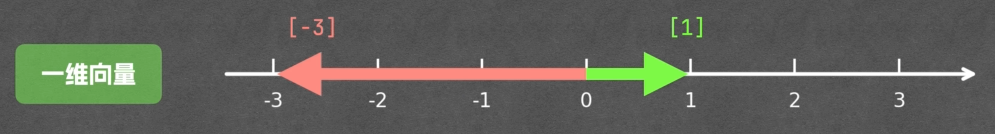
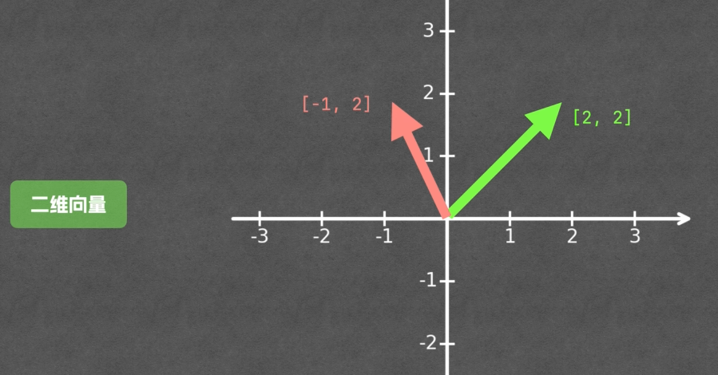
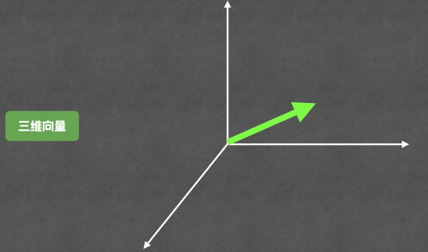
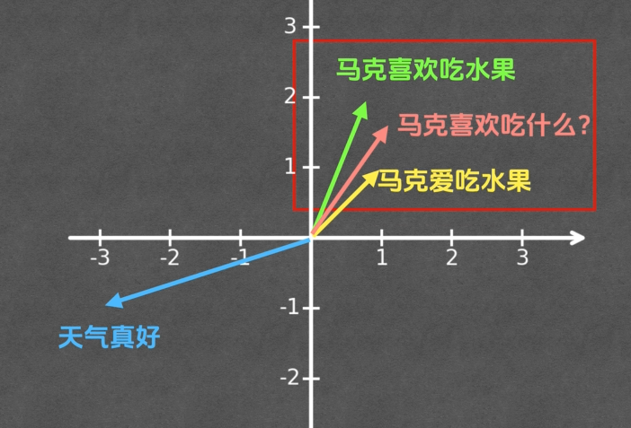
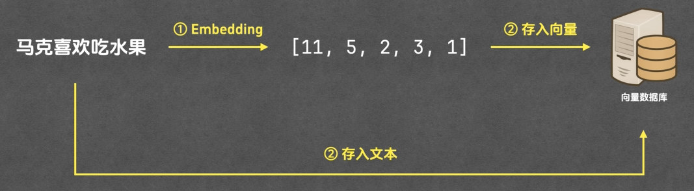
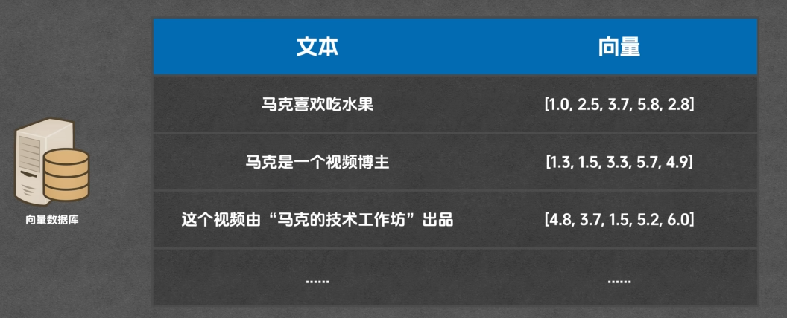
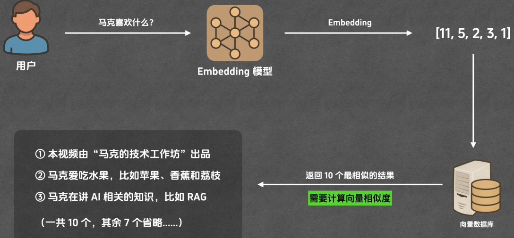
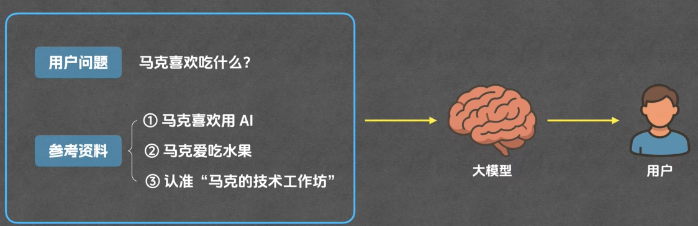
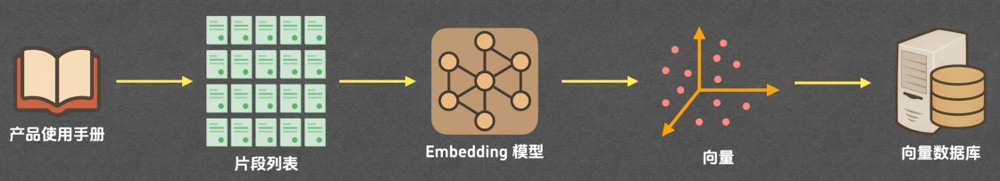
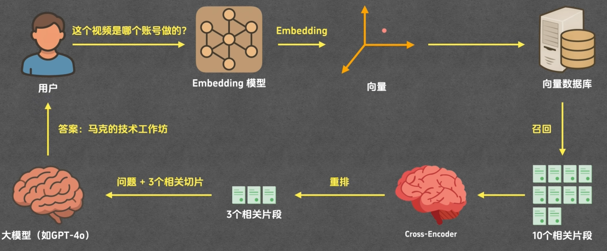

# RAG01

Retrieval-Augmented-Generation（检索增强生成）

---

**先从资料库里检索相关内容**

**再基于这些内容来生成答案**

---

## 实现原理

分片 → 索引 → 召回 → 重排 → 生成

&nbsp;

---

提问前链路

分片 → 索引

---

提问后链路

召回 → 重排 → 生成

&nbsp;

## 分片

把文档切割成多个片段，可以使用多种切分方式，如按页码、段落

&nbsp;

## 索引

1. 通过**Embedding**将片段文本转换为**向量**
2. 将片段文本和片段向量存入**向量数据库**中

&nbsp;

### 向量

&nbsp;

### Embedding

[https://huggingface.co/spaces/mteb/](https://huggingface.co/spaces/mteb/)

&nbsp;

### 向量数据库

用于存储和查询**向量**的数据库

&nbsp;

## 召回

搜索与用户问题相关的片段

计算向量相似度

- 余弦相似度
- 欧氏距离
- 点积
- …

&nbsp;

## 重排

根据召回结果进行重拍，得到重排结果

&nbsp;

&nbsp;

## 生成过程

&nbsp;

## 整体流程

准备部分（提问前）

回答部分（提问后）

&nbsp;

&nbsp;