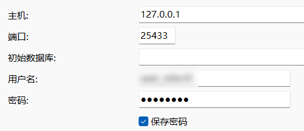
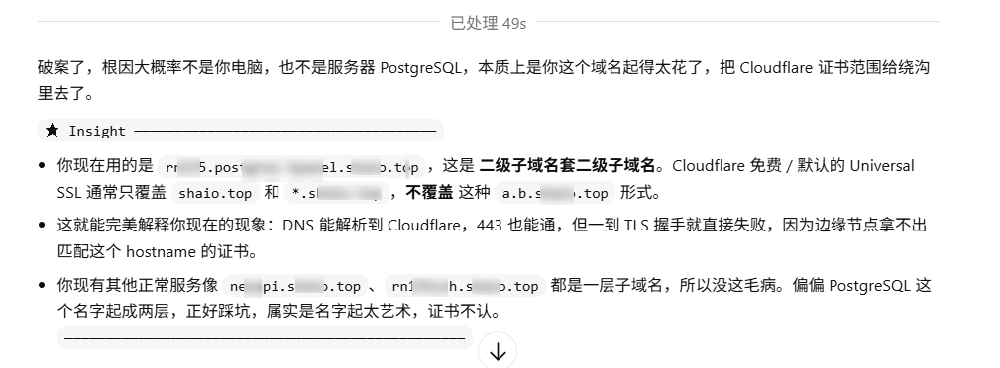

起因服务器在国外，ip直连总是遇到各种各样的问题，于是干脆用Cloudflare Tunnel通过域名方式来连接数据库。

```
# ===== xxx =====
# description: rn135ssh.example.top manual entry
# environment: development
# tags: manual,rn135ssh
# location: 1Panel
# created_at: 2026-03-23 15:15:46
# updated_at: 2026-03-23 15:15:46
Host rn135ssh
    HostName rn135ssh.example.top
    User root
    IdentityFile C:\Users\Root\.ssh\dell
    ProxyCommand "C:/Users/Root/AppData/Local/Microsoft/WinGet/Packages/Cloudflare.cloudflared_Microsoft.Winget.Source_8wekyb3d8bbwe/cloudflared.exe" access ssh --hostname %h
```


去除每次都要输入passphrase验证：

```powershell
Set-Service ssh-agent -StartupType Automatic
Start-Service ssh-agent
ssh-add C:\Users\Root\.ssh\dell
```

安装cloudflare：

```
winget install --id Cloudflare.cloudflared
```

设置连接：

```bash
cloudflared access tcp --hostname db.postgres-xxx.example.top --url 127.0.0.1:15433
2026-03-23T06:37:04Z INF Start Websocket listener host=127.0.0.1:15433
```

即可localhost:15433访问数据库


**踩坑：**

1. **开启了虚拟网卡代理**

2. 罪魁祸首，域名起的太花了=-=

   

3. 