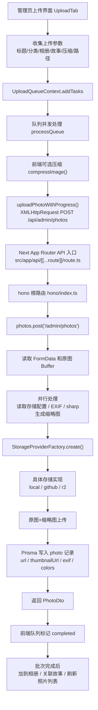

```mermaid
flowchart TD
  A["管理页上传界面 UploadTab"] --> B["收集上传参数\n标题/分类/相册/故事/压缩/路径"]
  B --> C["UploadQueueContext.addTasks"]
  C --> D["队列并发处理 processQueue"]
  D --> E["前端可选压缩 compressImage()"]
  E --> F["uploadPhotoWithProgress()\nXMLHttpRequest POST /api/admin/photos"]
  F --> G["Next App Router API 入口\nsrc/app/api/[[...route]]/route.ts"]
  G --> H["hono 根路由 hono/index.ts"]
  H --> I["photos.post('/admin/photos')"]
  I --> J["读取 FormData 和原图 Buffer"]
  J --> K["并行处理\n读取存储配置 / EXIF / sharp生成缩略图"]
  K --> L["StorageProviderFactory.create()"]
  L --> M["具体存储实现\nlocal / github / r2"]
  M --> N["原图+缩略图上传"]
  N --> O["Prisma 写入 photo 记录\nurl / thumbnailUrl / exif / colors"]
  O --> P["返回 PhotoDto"]
  P --> Q["前端队列标记 completed"]
  Q --> R["批次完成后\n加到相册 / 关联故事 / 刷新照片列表"]

```