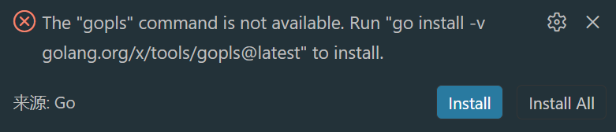

# Golang



这个提示的意思是：你的 Go 编辑器/插件想调用 gopls，但系统里找不到这个命令。

gopls 是 Go 官方语言服务器，主要给 VS Code、GoLand、Neovim 等编辑器提供代码补全、跳转定义、重命名、格式化、诊断等功能。

命令：

```
go install -v golang.org/x/tools/gopls@latest
```

就是安装最新版 gopls。

然后，添加至环境变量：

```
C:\Users\Administrator\go\bin
```


```go
package main // 程序的包名
```

[1.变量和常量](1%20%E5%8F%98%E9%87%8F%E5%92%8C%E5%B8%B8%E9%87%8F.md)

[2.输入输出](2%20%E8%BE%93%E5%85%A5%E8%BE%93%E5%87%BA.md)

[3.基本数据类型](3%20%E5%9F%BA%E6%9C%AC%E6%95%B0%E6%8D%AE%E7%B1%BB%E5%9E%8B.md)

[4.数组、切片和Map](4%20%E6%95%B0%E7%BB%84%E3%80%81%E5%88%87%E7%89%87%E5%92%8CMap.md)

[5.判断](5%20%E5%88%A4%E6%96%AD.md)

[函数多值返回](%E5%87%BD%E6%95%B0%E5%A4%9A%E5%80%BC%E8%BF%94%E5%9B%9E.md)

[import导入和init方法](import%E5%AF%BC%E5%85%A5%E5%92%8Cinit%E6%96%B9%E6%B3%95.md)

[指针](%E6%8C%87%E9%92%88.md)

[defer](defer.md)

[OOP](OOP.md)

[反射](%E5%8F%8D%E5%B0%84.md)

[goroutine](goroutine.md)

[channel](channel.md)

[GoModules](GoModules.md)

# Wails

```sql
├── build/                 # 构建和打包相关资源
│   ├── appicon.png        # 应用程序图标
│   ├── darwin/            # macOS 平台特定文件 (如 Info.plist)
│   └── windows/           # Windows 平台特定文件 (如 .manifest)
├── frontend/              # 前端项目文件 (由 Vite 等构建)
│   ├── src/               # 前端源代码
│   ├── package.json       # 前端依赖管理
│   └── ...
├── go.mod                 # Go 模块依赖管理
├── go.sum                 # Go 模块依赖校验文件
├── main.go                # 应用入口文件
└── wails.json             # Wails 项目配置文件
```

；