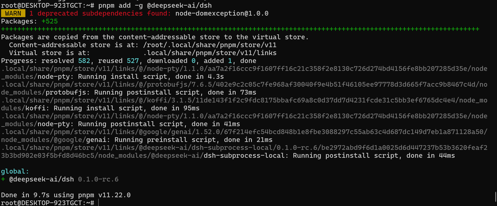
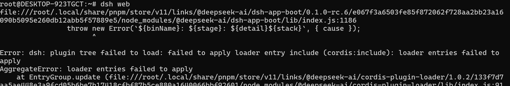
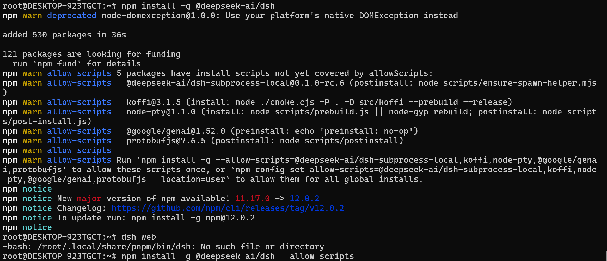

## 安装nvm

```
curl -o- https://raw.githubusercontent.com/nvm-sh/nvm/v0.40.0/install.sh | bash
```

```
source /root/.bashrc
```

```
nvm command -v nvm
nvm install --lts
nvm list
```

&nbsp;

## 安装dsh

```
pnpm add -g @deepseek-ai/dsh
```

报错：

```
...
.../node_modules/node-pty install$ node scripts/prebuild.js || node-gyp rebuild
│ > Checking prebuilds...
│ > Rebuilding because directory /root/.local/share/pnpm/store/v11/links/@/node-pty/1.1.0/aa7a2f16ccc9f1607ff16c21c35…
│ gyp info it worked if it ends with ok
│ gyp info using node-gyp@12.3.0
│ gyp info using node@24.19.0 | linux | x64
│ gyp info find Python using Python version 3.10.12 found at "/usr/bin/python3"
│ gyp http GET https://nodejs.org/download/release/v24.19.0/node-v24.19.0-headers.tar.gz
│ gyp http 200 https://nodejs.org/download/release/v24.19.0/node-v24.19.0-headers.tar.gz
│ gyp http GET https://nodejs.org/download/release/v24.19.0/SHASUMS256.txt
│ gyp http 200 https://nodejs.org/download/release/v24.19.0/SHASUMS256.txt
│ gyp info spawn /usr/bin/python3
│ gyp info spawn args [
│ gyp info spawn args '/mnt/d/DevKit/nvm/v22.23.2/node_modules/pnpm/dist/node_modules/node-gyp/gyp/gyp_main.py',
│ gyp info spawn args 'binding.gyp',
│ gyp info spawn args '-f',
│ gyp info spawn args 'make',
│ gyp info spawn args '-I',
│ gyp info spawn args '/root/.local/share/pnpm/store/v11/links/@/node-pty/1.1.0/aa7a2f16ccc9f1607ff16c21c358f2e8130c7…
│ gyp info spawn args '-I',
│ gyp info spawn args '/mnt/d/DevKit/nvm/v22.23.2/node_modules/pnpm/dist/node_modules/node-gyp/addon.gypi',
│ gyp info spawn args '-I',
│ gyp info spawn args '/root/.cache/node-gyp/24.19.0/include/node/common.gypi',
│ gyp info spawn args '-Dlibrary=shared_library',
│ gyp info spawn args '-Dvisibility=default',
│ gyp info spawn args '-Dnode_root_dir=/root/.cache/node-gyp/24.19.0',
│ gyp info spawn args '-Dnode_gyp_dir=/mnt/d/DevKit/nvm/v22.23.2/node_modules/pnpm/dist/node_modules/node-gyp',
│ gyp info spawn args '-Dnode_lib_file=/root/.cache/node-gyp/24.19.0/<(target_arch)/node.lib',
│ gyp info spawn args '-Dmodule_root_dir=/root/.local/share/pnpm/store/v11/links/@/node-pty/1.1.0/aa7a2f16ccc9f1607ff…
│ gyp info spawn args '-Dnode_engine=v8',
│ gyp info spawn args '--depth=.',
│ gyp info spawn args '--no-parallel',
│ gyp info spawn args '--generator-output',
│ gyp info spawn args 'build',
│ gyp info spawn args '-Goutput_dir=.'
│ gyp info spawn args ]
│ gyp ERR! build error
│ gyp ERR! stack Error: not found: make
│ gyp ERR! stack at getNotFoundError (/mnt/d/DevKit/nvm/v22.23.2/node_modules/pnpm/dist/node_modules/which/lib/index.…
│ gyp ERR! stack at which (/mnt/d/DevKit/nvm/v22.23.2/node_modules/pnpm/dist/node_modules/which/lib/index.js:77:9)
│ gyp ERR! stack at async doWhich (/mnt/d/DevKit/nvm/v22.23.2/node_modules/pnpm/dist/node_modules/node-gyp/lib/build.…
│ gyp ERR! stack at async loadConfigGypi (/mnt/d/DevKit/nvm/v22.23.2/node_modules/pnpm/dist/node_modules/node-gyp/lib…
│ gyp ERR! stack at async build (/mnt/d/DevKit/nvm/v22.23.2/node_modules/pnpm/dist/node_modules/node-gyp/lib/build.js…
│ gyp ERR! stack at async run (/mnt/d/DevKit/nvm/v22.23.2/node_modules/pnpm/dist/node_modules/node-gyp/bin/node-gyp.j…
│ gyp ERR! System Linux 6.18.33.2-microsoft-standard-WSL2
│ gyp ERR! command "/root/.nvm/versions/node/v24.19.0/bin/node" "/mnt/d/DevKit/nvm/v22.23.2/node_modules/pnpm/dist/no…
│ gyp ERR! cwd /root/.local/share/pnpm/store/v11/links/@/node-pty/1.1.0/aa7a2f16ccc9f1607ff16c21c358f2e8130c726d274bd…
│ gyp ERR! node -v v24.19.0
│ gyp ERR! node-gyp -v v12.3.0
│ gyp ERR! $npm_package_name node-pty
│ gyp ERR! $npm_package_version 1.1.0
│ gyp ERR! not ok
└─ Failed in 12.2s at /root/.local/share/pnpm/store/v11/links/@/node-pty/1.1.0/aa7a2f16ccc9f1607ff16c21c358f2e8130c726d274bd4156fe8bb207285d35e/node_modules/node-pty
.local/share/pnpm/store/v11/links/@/protobufjs/7.6.5/402e9c2c05c7fe968af30040f9e4b51f46105ee97778d3d665f7acc9b8467c4d/node_modules/protobufjs: Running postinstall script, done in 101ms
[ELIFECYCLE] Command failed with exit code 1.
```

解决

```
sudo apt update
sudo apt install -y build-essential
```



启动失败，pnpm不兼容



移除相关包，使用npm安装

```
pnpm remove -g @deepseek-ai/dsh
(可选) 清理不再被引用的存储数据
pnpm store prune
```

npm安装



&nbsp;