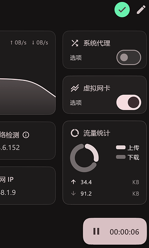
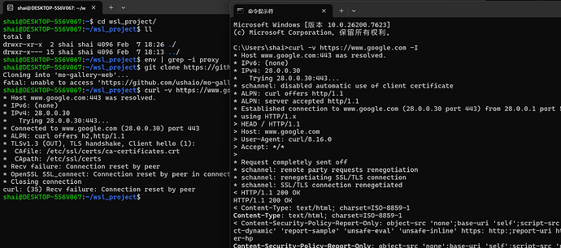
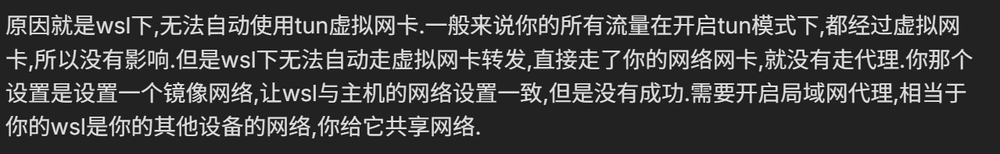

---

使用Flclash开启虚拟网卡，想wsl也使用Windows的代理的，但是发现不生效，生效的前提是开启系统代理，但这样就有违该设置了。


wlsconfig配置：

```
[wsl2]
networkingMode=Mirrored
autoProxy=false
firewall=false
processors=8
memory=16GB
swap=0
dnsTunneling=false
```

Flclash配置



其他测试：




## 最后解决方案：

**临时方案：**

同时开启系统代理


**一些参考性的回答：**




**建设性回答：**

flclash不能监听0.0.0.0,只接受127.0.0.1 走局域网代理的话走不通，后面换成了clash party [请问如何将监听地址改为0.0.0.0？ · Issue #1037 · chen08209/FlClash](https://github.com/chen08209/FlClash/issues/1037)


最后也确实，换了clash party后单独开启虚拟网卡也解决了。
