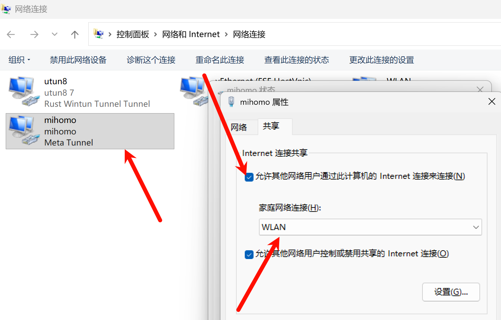

可能是开启虚拟网卡时直接关机等原因，重启后虚拟网卡模式失效了，并且退出重开也无法解决，只能用系统代理。

解决方案：

在属性里面，勾选【允许其他网络用户....】保存后，再重新关闭即可解决。

上述解决方案发现重启后就失效了...

参考链接：

https://github.com/mihomo-party-org/clash-party/issues/453

https://blog.csdn.net/weixin_63094916/article/details/143966897

https://github.com/clash-verge-rev/clash-verge-rev/issues/4114
